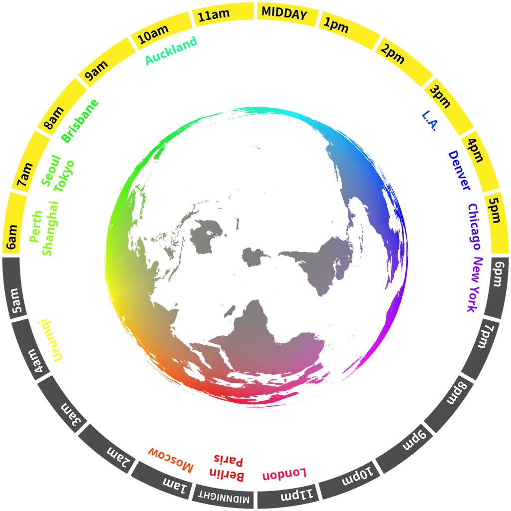

***

<h1 align="center">

    

&nbsp;
Gorialis
</h1>

Hello! I like making tangible software.

***

My name is Devon and this is where you can view my public projects.

I work in a handful of different disciplines, but my recent work tends mostly towards reverse engineering, DevOps, and graphical/UX design.

Provided nothing goes wrong, this README will *dynamically regenerate* using GitHub Actions every hour! (it last updated at **19:00 UTC, 2025-08-09**)

<h2>World clock</h2>

<h2>JLPT words of the hour</h2>
<table align="center">
    <tr>
        <td>JLPT N1</td>
        <td>
            
みわたす

            <h3 align="center"><b><a href="https://jisho.org/search/%E8%A6%8B%E6%B8%A1%E3%81%99">見渡す</a></b></h3>
        </td>
        <td>
            
to look out over,<wbr> to survey (scene),<wbr> to take an extensive view of

        </td>
    </tr>
    <tr>
        <td>JLPT N2</td>
        <td>
            
えんそく

            <h3 align="center"><b><a href="https://jisho.org/search/%E9%81%A0%E8%B6%B3">遠足</a></b></h3>
        </td>
        <td>
            
trip,<wbr> hike,<wbr> picnic

        </td>
    </tr>
    <tr>
        <td>JLPT N3</td>
        <td>
            
そしき

            <h3 align="center"><b><a href="https://jisho.org/search/%E7%B5%84%E7%B9%94">組織</a></b></h3>
        </td>
        <td>
            
organization;  structure;  tissue

        </td>
    </tr>
    <tr>
        <td>JLPT N4</td>
        <td>
            
きかい

            <h3 align="center"><b><a href="https://jisho.org/search/%E6%A9%9F%E4%BC%9A">機会</a></b></h3>
        </td>
        <td>
            
chance,<wbr> opportunity

        </td>
    </tr>
    <tr>
        <td>JLPT N5</td>
        <td>
            
おばあさん

            <h3 align="center"><b><a href="https://jisho.org/search/%E3%81%8A%E3%81%B0%E3%81%82%E3%81%95%E3%82%93">おばあさん</a></b></h3>
        </td>
        <td>
            
grandmother,<wbr> female senior-citizen

        </td>
    </tr>
</table>

<h2>Other things</h2>

🌕 Lunar phase

The moon is approximately 55.78% through its phase (Full Moon).

&#x1f5bc; Fractal of the hour

> 

&#x23f2; Year percentage bar

<pre><code>2025 [████████████▁▁▁▁▁▁▁▁] 60.49%</code></pre>

