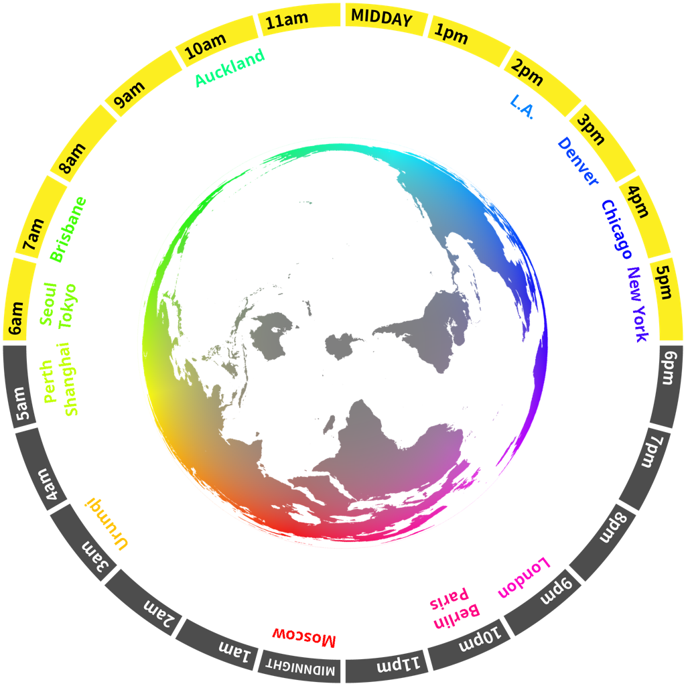
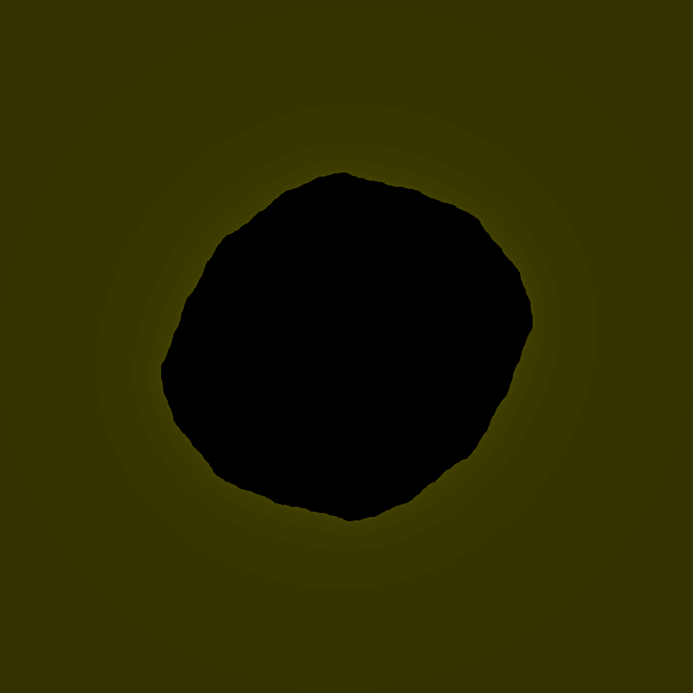

***

<h1 align="center">

    

&nbsp;
Gorialis
</h1>

Hello! I like making tangible software.

***

My name is Devon and this is where you can view my public projects.

I work in a handful of different disciplines, but my recent work tends mostly towards reverse engineering, DevOps, and graphical/UX design.

Provided nothing goes wrong, this README will *dynamically regenerate* using GitHub Actions every hour! (it last updated at **07:17 UTC, 2026-03-02**)

<h2>World clock</h2>

<h2>JLPT words of the hour</h2>
<table align="center">
    <tr>
        <td>JLPT N1</td>
        <td>
            
にづくり

            <h3 align="center"><b><a href="https://jisho.org/search/%E8%8D%B7%E9%80%A0%E3%82%8A">荷造り</a></b></h3>
        </td>
        <td>
            
packing,<wbr> baling,<wbr> crating

        </td>
    </tr>
    <tr>
        <td>JLPT N2</td>
        <td>
            
おかえり

            <h3 align="center"><b><a href="https://jisho.org/search/%E3%81%8A%E5%B8%B0%E3%82%8A">お帰り</a></b></h3>
        </td>
        <td>
            
return,<wbr> welcome

        </td>
    </tr>
    <tr>
        <td>JLPT N3</td>
        <td>
            
さんこう

            <h3 align="center"><b><a href="https://jisho.org/search/%E5%8F%82%E8%80%83">参考</a></b></h3>
        </td>
        <td>
            
reference,<wbr> consultation

        </td>
    </tr>
    <tr>
        <td>JLPT N4</td>
        <td>
            
たまに

            <h3 align="center"><b><a href="https://jisho.org/search/%E3%81%9F%E3%81%BE%E3%81%AB">たまに</a></b></h3>
        </td>
        <td>
            
occasionally

        </td>
    </tr>
    <tr>
        <td>JLPT N5</td>
        <td>
            
なん～

            <h3 align="center"><b><a href="https://jisho.org/search/%E4%BD%95%EF%BD%9E">何～</a></b></h3>
        </td>
        <td>
            
what sort of ~

        </td>
    </tr>
</table>

<h2>Other things</h2>

🌕 Lunar phase

The moon is approximately 48.32% through its phase (Full Moon).

&#x1f5bc; Fractal of the hour

> 

&#x23f2; Year percentage bar

<pre><code>2026 [███▁▁▁▁▁▁▁▁▁▁▁▁▁▁▁▁▁] 16.52%</code></pre>

